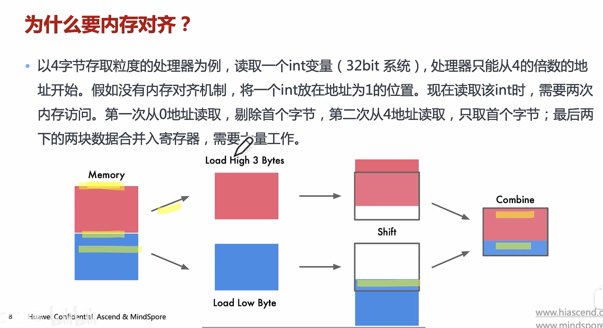

# 内存对齐的好处

## 访问速度

- 当代处理器具有多个级别的高速缓存，数据必须通过这些高速缓存；支持单字节读取将使内存子系统的吞吐量与执行单元的吞吐量紧密的绑定（也就是CPU的吞吐量），消耗大量CPU资源的同时，称为系统性能的瓶颈。可以类比在硬盘读写中DMA性能是如何超越PIO（Programmed Input/Output）的。
- CPU总是以其字的大小进行内存读取，进行未对齐的内存访问时，处理器将读取多个字，需要读取变量所跨越内存的所有字，同时进行处理。将导致访问请求数据所需要的内存事务增加2倍

## 原子性

- CPU可以在一个对齐的内存字上操作，意味着没有指令可以中断该操作。这对于许多无锁数据结构和其他并发范式的正确性至关重要
- 现代 CPU 的 **硬件保证**，对 **对齐的、大小合适的内存字** 的读写是 **原子的（Atomic）**，即：
  - **单条机器指令** 可以完成该操作（如 `MOV` 指令）。
  - **该操作不会被其他 CPU 核心或线程中断**（即不会出现“读一半”或“写一半”的情况）。
